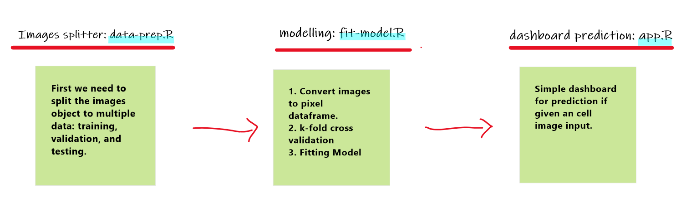
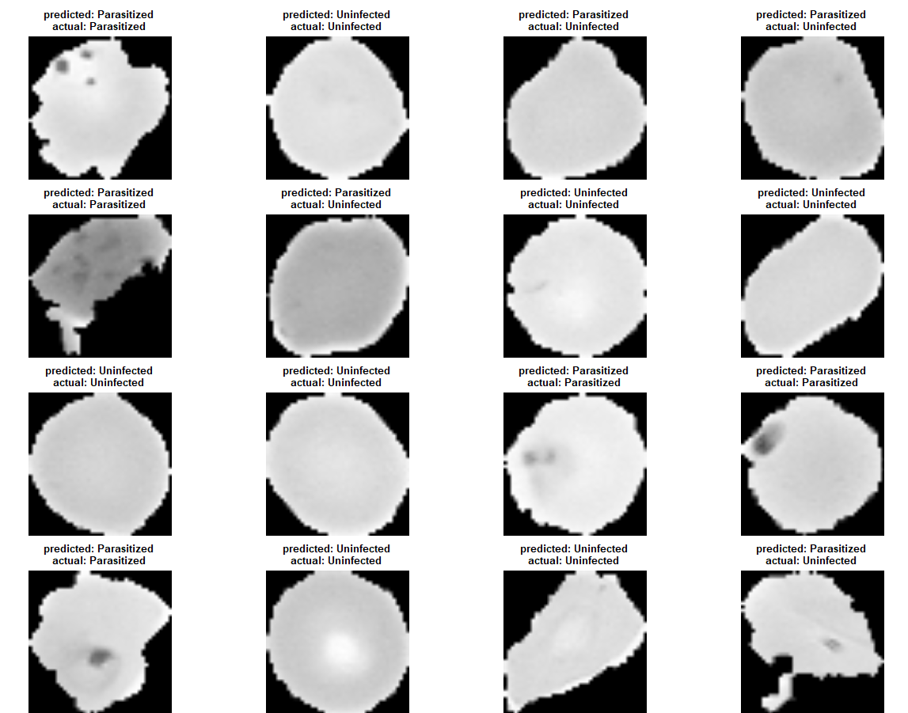

# Image-Classification with Random Forest

an example script if you want to do image-classification stuff with Random Forest. The datasets are available at [cell_images](ftp://lhcftp.nlm.nih.gov/Open-Access-Datasets/Malaria/cell_images.zip). Please download so you can follow the script.

## Workflow

Here is a quick brief of the project workflow.

If you want to try predict an image, please use one of the cell images [listed here](https://drive.google.com/drive/folders/1W0xH-VF1aWkWjGLvXCIEmkCBSbvGnMsq?usp=sharing).

## Model Evaluation

Ya, we know it's not a best measure to inference image by using Random Forest.

-----